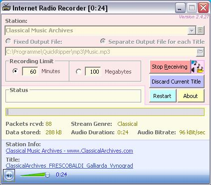



## Internet Radio Recorder Update \#2

### Description

Tune to internet radio stations and record music on your hard disk while listening at the same time.

This app was almost completely rewritten from code by Coder Ghost *CodeId=64608*. A few ideas by some of you have been implemented: a- Sticky Discard Button and b- Selective Title List. (Includes one or two re-usable coding treasures). Download is 39 kB.
 
### More Info
 

             |
---                |---
**Submitted On**   |2006-08-31 21:07:52
**By**             |[ULLI](https://github.com/Planet-Source-Code/PSCIndex/blob/master/ByAuthor/ulli.md)
**Level**          |Advanced
**User Rating**    |4.8 (130 globes from 27 users)
**Compatibility**  |VB 6\.0
**Category**       |[Sound/MP3](https://github.com/Planet-Source-Code/PSCIndex/blob/master/ByCategory/sound-mp3__1-45.md)
**World**          |[Visual Basic](https://github.com/Planet-Source-Code/PSCIndex/blob/master/ByWorld/visual-basic.md)
**Archive File**   |[Internet\_R201706912006\.zip](https://github.com/Planet-Source-Code/ulli-internet-radio-recorder-update-2__1-66389/archive/master.zip)

